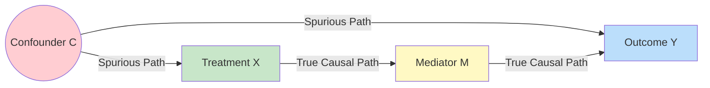

# GenPark Backdoor Criterion Confounder Adjustment Skill

Graph-theoretic backdoor criterion validator and minimal confounder adjustment set identifier.

Discover more at [GenPark](https://genpark.ai) and the [GenPark MCP Catalog](https://genpark.ai/mcp).

## Features
- Graph-theoretic d-separation checking across arbitrary causal DAGs.
- Automatic descendant prohibition enforcement.
- Detection of unblocked backdoor paths and collider bias.
